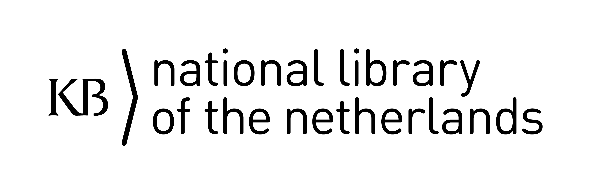

 

# Overview of KB-Wikimedia materials on Github

## [Stories](https://kbnlwikimedia.github.io/stories/index.html)

## Tools
* glamorousToHTML
* videoltools
* One more

## Workshops and courses
* Wikidata PL 
* Wikibase
* WikidataKB

## Projects

