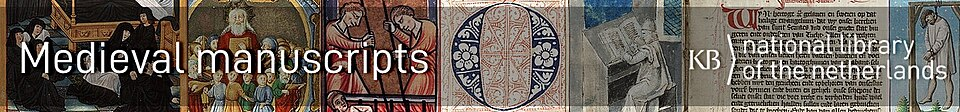
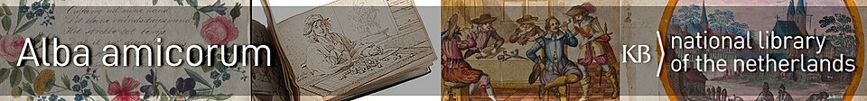
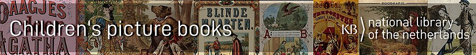
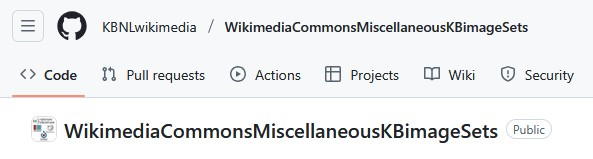
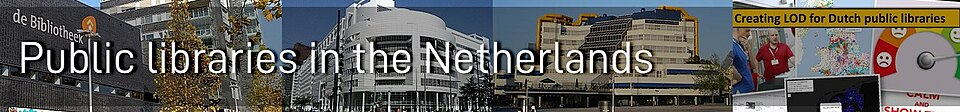
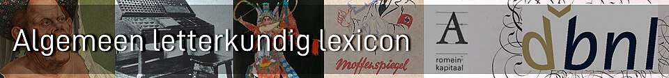
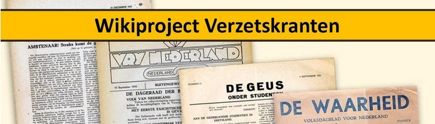

<table width="100%" border="0"><tr><td align="left">
<a target="_blank" href="https://kbnlwikimedia.github.io/"><< Back to homepage</a>
</td><td align="right">
<a target="_blank" href="https://github.com/KBNLwikimedia/kbnlwikimedia.github.io" target="_blank">>> To the Github repo of this page</a>
</td></tr></table>

 

# Overview of Github repos for collection related projects of the KB 
 

<table border="1">
  <tr>
    <th>Github repo</th>
    <th>Description</th>
    <th>Links</th>
  </tr>
  <tr>
    <td> <a target="_blank" href="https://github.com/KBNLwikimedia/KBCollectionHighlights">KBCollectionHighlights</a></td>
    <td>Code, data and stories related to Wikifying the <a target="_blank" href="https://www.kb.nl/zoeken/content/categorie/topstuk">collection highlights of the KB</a>, the national library of the Netherlands</td>
    <td>
      <ul>
        <li><a target="_blank" href="https://www.wikidata.org/wiki/Wikidata:WikiProject_Collection_highlights_National_Library_of_the_Netherlands">Wikidata project</a></li><li><a target="_blank" href="https://nl.wikipedia.org/wiki/Wikipedia:GLAM/Koninklijke_Bibliotheek_en_Nationaal_Archief/Topstukken">Dutch Wikipedia project page</a></li>
        <li><a target="_blank" href="https://commons.wikimedia.org/wiki/Category:Collection_highlights_of_Koninklijke_Bibliotheek">Commons category</a></li><li><a target="_blank" href="https://commons.wikimedia.org/wiki/Koninklijke_Bibliotheek/Collection_highlights">Commons gallery</a></li><li><a target="_blank" href="https://kbnlwikimedia.github.io/KBCollectionHighlights/stories/">Stories</a></li>
      </ul>
    </td>
  </tr>
  <tr>
    <td> <a target="_blank" href="https://github.com/KBNLwikimedia/KBMedievalManuscripts">KBMedievalManuscripts</a></td>
    <td>Repo for code, data and images related to the medieval manuscripts of the KB on Wikimedia</td>
    <td><ul>
        <li><a target="_blank" href="https://www.wikidata.org/wiki/Wikidata:WikiProject_Medieval_manuscripts_National_Library_of_the_Netherlands">Wikidata project</a></li>
        <li><a target="_blank" href="https://commons.wikimedia.org/wiki/Category:Medieval_manuscripts_from_Koninklijke_Bibliotheek">Commons category</a></li><li><a target="_blank" href="https://commons.wikimedia.org/wiki/Koninklijke_Bibliotheek/Manuscripts/Medieval">Commons gallery</a></li>
      </ul></td>
  </tr>
  <tr>
    <td> <a target="_blank" href="https://github.com/KBNLwikimedia/Alba-Amicorum">Alba-Amicorum</a></td>
    <td>Repo for code, data and images related to the <a target="_blank" href="https://geheugen.delpher.nl/nl/geheugen/pages/collectie/Alba+amicorum+van+de+KB">alba amicorum of the KB</a> on Wikimedia</td>
    <td><ul>
        <li><a target="_blank" href="https://www.wikidata.org/wiki/Wikidata:WikiProject_Alba_amicorum_National_Library_of_the_Netherlands">Wikidata project</a></li><li><a target="_blank" href="https://nl.wikipedia.org/wiki/Wikipedia:GLAM/Koninklijke_Bibliotheek_en_Nationaal_Archief/Projecten#Alba_amicorum">Dutch Wikipedia project page</a></li>
        <li><a target="_blank" href="https://commons.wikimedia.org/wiki/Category:Alba_amicorum_from_Koninklijke_Bibliotheek">Commons category</a></li><li><a target="_blank" href="https://commons.wikimedia.org/wiki/Koninklijke_Bibliotheek/Alba_amicorum">Commons gallery</a></li>
      </ul></td>
  </tr>
  <tr>
    <td> <a target="_blank" href="https://github.com/KBNLwikimedia/KBChildrensPictureBooks">KBChildrensPictureBooks</a></td><td>Repo for code, data and images related to <a target="_blank" href="https://geheugen.delpher.nl/nl/geheugen/pages/collectie/Prentenboeken+van+1810+tot+1950">children's picture books of the KB</a> on Wikimedia </td>
    <td><ul>
        <li><a target="_blank" href="https://www.wikidata.org/wiki/Wikidata:WikiProject_Children%27s_picture_books_National_Library_of_the_Netherlands">Wikidata project</a></li>
        <li><a target="_blank" href="https://commons.wikimedia.org/wiki/Category:Picture_books_from_Koninklijke_Bibliotheek">Commons category</a></li><li><a target="_blank" href="https://commons.wikimedia.org/wiki/Koninklijke_Bibliotheek/Books/Picture_books">Commons gallery</a></li>
      </ul></td>
  </tr>
  <tr>
    <td> <a target="_blank" href="https://github.com/KBNLwikimedia/WikimediaCommonsMiscellaneousKBimageSets">WikimediaCommonsMiscellaneousKBimageSets</a></td>
    <td>Repo related to miscellaneous KB image sets on Wikimedia Commons, other than collection highlights, medieval manuscripts, alba amicorum or children's books</td>
    <td><ul>
        <li><a target="_blank" href="https://commons.wikimedia.org/wiki/Category:Koninklijke_Bibliotheek,_Netherlands">Commons category</a></li><li><a target="_blank" href="https://commons.wikimedia.org/wiki/Koninklijke_Bibliotheek">Commons gallery</a></li>
      </ul></td>
  </tr>
  <tr>
    <td> <a target="_blank" href="https://github.com/KBNLwikimedia/DutchLiteraryAwards">DutchLiteraryAwards</a></td>
    <td>Repo for the Wikidata project to create linked open data for the most important Dutch language literary awards </td>
    <td><ul>
        <li><a target="_blank" href="https://www.wikidata.org/wiki/Wikidata:WikiProject_Dutch_Literary_Awards">Wikidata project</a></li>
        <li><a target="_blank" href="https://www.wikidata.org/wiki/Wikidata:WikiProject_Dutch_Literary_Awards/Authors">Three fully described award winning authors</a></li>
      </ul></td>
  </tr>
  <tr>
    <td> <a target="_blank" href="https://github.com/KBNLwikimedia/DutchPublicLibraries">DutchPublicLibraries</a></td>
    <td>Repo for the Wikidata project to create linked open data for  pm 1500 public libraries in The Netherlands</td>
    <td><ul>
        <li><a target="_blank" href="https://www.wikidata.org/wiki/Wikidata:WikiProject_Netherlands_Public_Libraries">Wikidata project</a></li><li>The <a target="_blank" href="https://kbnlwikimedia.github.io/WikidataMapMakingWorkshop/">Wikidata map making workshop</a> is a direct result of this project.</li>
        </ul></td>
  </tr>
  <tr>
    <td> <a target="_blank" href="https://github.com/KBNLwikimedia/DBNL-Algemeen-letterkundig-lexicon">DBNL-Algemeen-letterkundig-lexicon</a></td>
    <td>Turning the Dutch <a target="_blank" href="https://www.dbnl.org/tekst/dela012alge01_01/" target="_blank">Algemeen Letterkundig Lexicon</a> into linked open data using Wikidata and Wikipedia.</td>
    <td><ul>
        <li><a target="_blank" href="https://www.wikidata.org/wiki/Wikidata:WikiProject_Algemeen_letterkundig_lexicon">Wikidata project</a></li>
        <li><a target="_blank" href="https://nl.wikipedia.org/wiki/Wikipedia:GLAM/Koninklijke_Bibliotheek_en_Nationaal_Archief/ALL">Dutch Wikipedia project page</a></li>
      </ul></td>
  </tr>
  <tr>
    <td> <a target="_blank" href="https://github.com/KBNLwikimedia/VerzetskrantenWO2">VerzetskrantenWO2</a></td><td>Software to generate <a target="_blank" href="https://nl.wikipedia.org/wiki/Wikipedia:Wikiproject/Verzetskranten/Beginnetjes">Wikipedia article stubs</a> from a database, related to Dutch underground newspapers from WW2</td>
    <td><ul>
        <li><a target="_blank" href="https://nl.wikipedia.org/wiki/Wikipedia:Wikiproject/Verzetskranten">Dutch Wikipedia project page</a></li>
        <li><a target="_blank" href="https://nl.wikipedia.org/wiki/Lijst_van_Nederlandse_verzetsbladen_uit_de_Tweede_Wereldoorlog">List of Dutch underground newspapers from WW2</a></li>
      </ul></td>
  </tr>
</table>                                        
