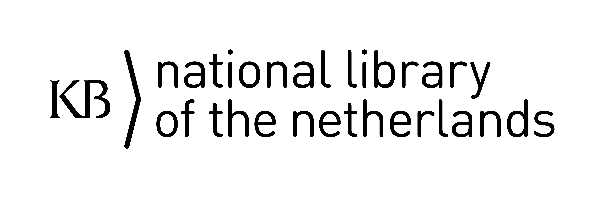
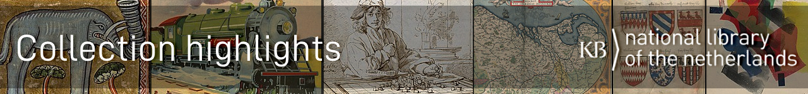

<table width="100%" border="0"><tr><td align="left">
<a href="https://kbnlwikimedia.github.io/"><< Back to homepage</a>
</td><td align="right">
<a href="https://github.com/KBNLwikimedia/kbnlwikimedia.github.io" target="_blank">>> To the Github repo of this page</a>
</td></tr></table>

 

# Overview of Github repos for projects related to the collections of the KB 
 

<table border="1">
  <tr>
    <th>Github repo</th>
    <th>Description</th>
    <th>Links</th>
  </tr>
  <tr>
    <td> <a href="https://github.com/KBNLwikimedia/KBCollectionHighlights">KBCollectionHighlights</a></td>
    <td>Code, data and stories related to the <a href="https://www.kb.nl/zoeken/content/categorie/topstuk">collection highlights of the KB</a>, the national library of the Netherlands</td>
    <td>
      <ul>
        <li><a href="https://www.wikidata.org/wiki/Wikidata:WikiProject_Collection_highlights_National_Library_of_the_Netherlands">Wikidata project</a></li>
        <li><a href="https://commons.wikimedia.org/wiki/Category:Collection_highlights_of_Koninklijke_Bibliotheek">Commons category</a></li><li><a href="https://commons.wikimedia.org/wiki/Koninklijke_Bibliotheek/Collection_highlights">Commons gallery</a></li><li><a href="https://nl.wikipedia.org/wiki/Wikipedia:GLAM/Koninklijke_Bibliotheek_en_Nationaal_Archief/Topstukken">Dutch Wikipedia project page</a></li><li><a href="https://kbnlwikimedia.github.io/KBCollectionHighlights/stories/">Stories</a></li>
      </ul>
    </td>
  </tr>
  <tr>
    <td><a href="https://github.com/KBNLwikimedia/KBChildrensPictureBooks">KBChildrensPictureBooks</a></td>
    <td></td>
    <td></td>
  </tr>
  <tr>
    <td><a href="https://github.com/KBNLwikimedia/WikimediaCommonsMiscellaneousKBimageSets">WikimediaCommonsMiscellaneousKBimageSets</a></td>
    <td></td>
    <td></td>
  </tr>
  <tr>
    <td><a href="https://github.com/KBNLwikimedia/KBMedievalManuscripts">KBMedievalManuscripts</a></td>
    <td></td>
    <td></td>
  </tr>
  <tr>
    <td><a href="https://github.com/KBNLwikimedia/DutchLiteraryAwards">DutchLiteraryAwards</a></td>
    <td></td>
    <td></td>
  </tr>
  <tr>
    <td><a href="https://github.com/KBNLwikimedia/DutchPublicLibraries">DutchPublicLibraries</a></td>
    <td></td>
    <td></td>
  </tr>
  <tr>
    <td><a href="https://github.com/KBNLwikimedia/DBNL-Algemeen-letterkundig-lexicon">DBNL-Algemeen-letterkundig-lexicon</a></td>
    <td></td>
    <td></td>
  </tr>
  <tr>
    <td><a href="https://github.com/KBNLwikimedia/Alba-Amicorum">Alba-Amicorum</a></td>
    <td></td>
    <td></td>
  </tr>
  <tr>
    <td><a href="https://github.com/KBNLwikimedia/VerzetskrantenWO2">VerzetskrantenWO2</a></td>
    <td></td>
    <td></td>
  </tr>
</table>                                        
