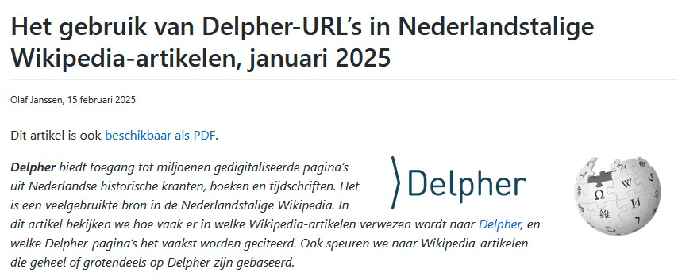
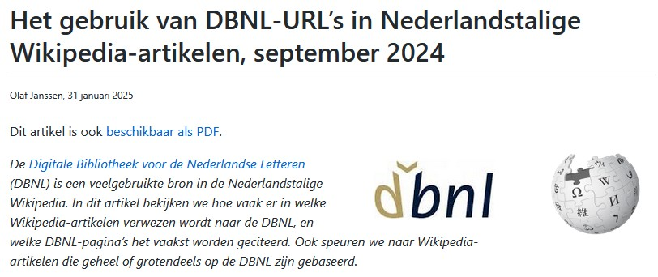
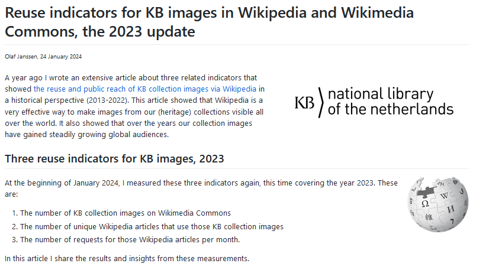
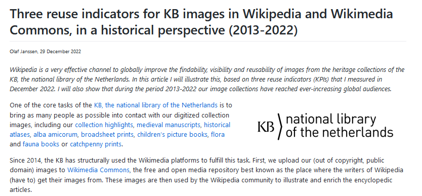
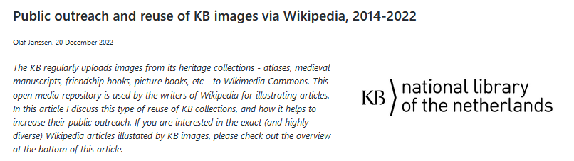
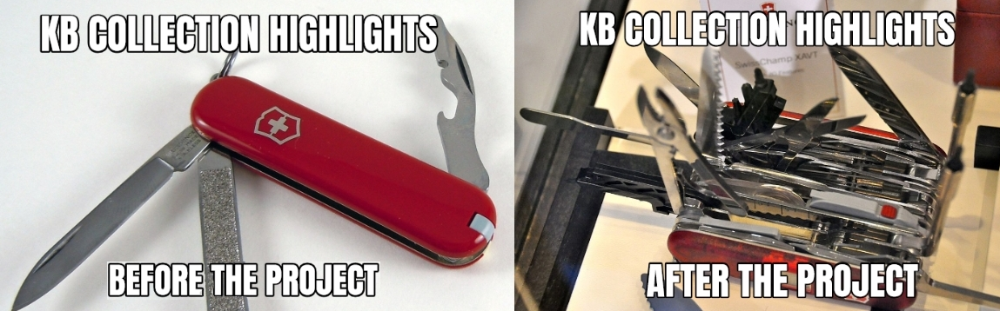
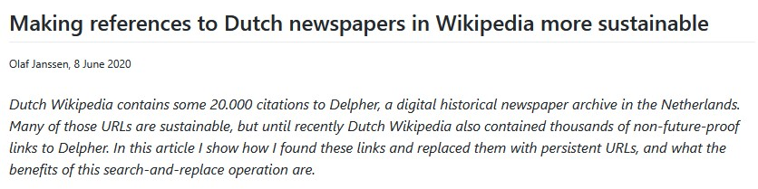
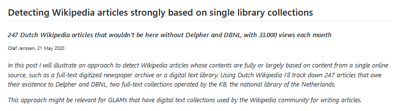

<table width="100%" border="0"><tr><td align="left">
<a href="https://kbnlwikimedia.github.io/"><< Back to homepage</a>
</td><td align="right">
<a href="https://github.com/KBNLwikimedia/kbnlwikimedia.github.io" target="_blank">>> To the Github repo of this page</a>
</td></tr></table>

 

# Overview of (data) stories on Github related to the Wikimedia effort of the KB
 

## [Free to use? Exploring public domain claims in Wikimedia Commons files sourced from Delpher (May 2025)](https://kbnlwikimedia.github.io/wikimedia-commons_copyright-templates/stories/Free%20to%20use%20-%20Exploring%20public%20domain%20claims%20in%20Wikimedia%20Commons%20files%20sourced%20from%20Delpher%20(May%202025).html)

<a href="https://kbnlwikimedia.github.io/wikimedia-commons_copyright-templates/stories/Free%20to%20use%20-%20Exploring%20public%20domain%20claims%20in%20Wikimedia%20Commons%20files%20sourced%20from%20Delpher%20(May%202025).html">article</a>

**Keywords:** Delpher, copyright, public domain, Wikimedia Commons, KB

*May 2025*

 [Delpher](https://www.delpher.nl) offers access to millions of digitized pages from Dutch historical newspapers, books, and magazines — a valuable resource frequently used on Wikimedia Commons. In the first part of this data story, we examine how the Wikimedia community has assigned public domain status to Commons files that have been sourced from Delpher. 
In the second part, we explore the validity of these claims and assess whether they align with the actual copyright status of the works. We identify common mistakes made by the Wikimedia community when applying public domain templates to files. Finally, we examine whether these errors have resulted in any serious copyright violations.

## [Het gebruik van Delpher-URL's in Nederlandstalige Wikipedia-artikelen, januari 2025](https://kbnlwikimedia.github.io/KB-Wiki-Stats-Graphs/stories/Het%20gebruik%20van%20Delpher%20in%20Nederlandstalige%20Wikipedia-artikelen,%20januari%202025.html)

**Keywords:** Delpher, Wikipedia, KB, URLs, references

*15 February 2025*

The Dutch full-text historical newspapers, books and periodicals archive [Delpher](https://www.delpher.nl) is a frequently used source in Dutch Wikipedia. In this article, we will examine how often Delpher is referred to and from which Wikipedia articles. We will also discover which pages in Delpher are cited most often. Finally, we will search for articles that are entirely or largely based on Delpher. (This article is in Dutch)

## [Het gebruik van DBNL-URL's in Nederlandstalige Wikipedia-artikelen, september 2024](https://kbnlwikimedia.github.io/KB-Wiki-Stats-Graphs/stories/Het%20gebruik%20van%20DBNL%20in%20Nederlandstalige%20Wikipedia-artikelen,%20september%202024.html)

**Keywords:** DBNL, Wikipedia, KB, URLs, references

*31 January 2025*

The [Digital Library for Dutch Literature](https://www.dbnl.org/) (DBNL) is a frequently used source in Dutch Wikipedia. In this article, we will examine how often DBNL is referred to and from which Wikipedia articles. We will also discover which pages in DBNL are cited most often. Finally, we will search for articles that are entirely or largely based on DBNL. (This article is in Dutch)

## [Reuse indicators for KB images in Wikipedia and Wikimedia Commons, the 2023 update](https://kbnlwikimedia.github.io/KB-Wiki-Stats-Graphs/stories/Reuse%20indicators%20for%20KB%20images%20in%20Wikipedia%20and%20Wikimedia%20Commons%2C%20the%202023%20update.html)

**Keywords:**  reuse, public reach, KB collection images, Wikipedia, Wikimedia Commons

*24 January 2024*

A year ago I wrote an extensive article about three related indicators that showed the [reuse and public reach of KB collection images via Wikipedia](https://kbnlwikimedia.github.io/KB-Wiki-Stats-Graphs/stories/Three%20reuse%20indicators%20for%20KB%20images%20in%20Wikipedia%20and%20Wikimedia%20Commons,%20in%20a%20historical%20perspective%20(2013-2022).html) in a historical perspective (2013-2022). This article showed that Wikipedia is a very effective way to make images from our (heritage) collections visible all over the world. It also showed that over the years our collection images have gained steadily growing global audiences.
At the beginning of January 2024, we measured these three indicators again, this time covering the year 2023. In this article we share the results and insights from these measurements.

## [Three reuse indicators for KB images in Wikipedia and Wikimedia Commons, in a historical perspective (2013-2022)](https://kbnlwikimedia.github.io/KB-Wiki-Stats-Graphs/stories/Three%20reuse%20indicators%20for%20KB%20images%20in%20Wikipedia%20and%20Wikimedia%20Commons,%20in%20a%20historical%20perspective%20(2013-2022).html)

**Keywords:**  reuse, public reach, KB collection images, Wikipedia, Wikimedia Commons

*29 December 2022*

Wikipedia is a very effective channel to globally improve the findability, visibility and reusability of images from the heritage collections of the KB. This article will illustrate this, based on three reuse indicators (KPIs) that the KB measured in December 2022. It will also show that during the period 2013-2022 our KB collections have reached ever-increasing global audiences.

## [Public outreach and reuse of KB images via Wikipedia, 2014-2022](https://kbnlwikimedia.github.io/GLAMorousToHTML/stories/Public%20outreach%20and%20reuse%20of%20KB%20images%20via%20Wikipedia%2C%202014-2022.html)

**Keywords:** Reuse, public reach, KB collection images, Wikipedia, Wikimedia Commons

*20 December 2022*

The KB regularly uploads images from its heritage collections - atlases, medieval manuscripts, friendship books, picture books, etc - to Wikimedia Commons. This open media repository is used by the writers of Wikipedia for illustrating articles. In this article I discuss this type of reuse of KB collections, and how it helps to increase their public outreach. If you are interested in the exact (and highly diverse) Wikipedia articles illustated by KB images, please check out the overview at the bottom of this article.

## [KB collection highlights - stories](https://kbnlwikimedia.github.io/KBCollectionHighlights/stories/)

**Keywords:** KB, collection highlights, reuse, Wikification, Wikidata, Wikipedia, Wikimedia Commons

#### [50 cool new things you can now do with KB's collection highlights](https://kbnlwikimedia.github.io/KBCollectionHighlights/stories/Cool%20new%20things%20you%20can%20now%20do%20with%20the%20KB's%20collection%20highlights/) 

*March 2021*

In this [series of 5 articles](https://kbnlwikimedia.github.io/KBCollectionHighlights/stories/Cool%20new%20things%20you%20can%20now%20do%20with%20the%20KB's%20collection%20highlights/) we show the added value of putting images and metadata of [digitised collection highlights](https://www.kb.nl/zoeken/content/categorie/topstuk) of the KB, national library of the Netherlands, into the Wikimedia infrastructure. By putting our collection highlights into Wikidata, Wikimedia Commons and Wikipedia, dozens of new functionalities have been added. As a result of Wikifying this collection, you can now do things with these highlights that were not possible before.

## [Making references to Dutch newspapers in Wikipedia more sustainable](https://kbnlwikimedia.github.io/WikimediaKBURLReplacement/stories/Making%20references%20to%20Dutch%20newspapers%20in%20Wikipedia%20more%20sustainable.html)

**Keywords:** Dutch Wikipedia, Delpher, digital sustainability, persistent URLs

*8 June 2020* 

Dutch Wikipedia contains some 20.000 citations to Delpher, a digital historical newspaper archive in the Netherlands. Many of those URLs are sustainable, but until recently Dutch Wikipedia also contained thousands of non-future-proof links to Delpher. In this article I show how I found these links and replaced them with persistent URLs, and what the benefits of this search-and-replace operation are.

## [Detecting Wikipedia articles strongly based on single library collections](https://kbnlwikimedia.github.io/KB-Wiki-Stats-Graphs/stories/Detecting%20Wikipedia%20articles%20strongly%20based%20on%20single%20library%20collections.html)

**Keywords:** Wikipedia, Delpher, DBNL, KB, reuse

*21 May 2020* 

This article illustrates an approach to detect Wikipedia articles whose contents are fully or largely based on content from a single online source, such as a full-text digitized newspaper archive or a digital text library. Using Dutch Wikipedia we'll track down 247 articles that owe their existence to Delpher and DBNL, two full-text collections operated by the KB, the national library of the Netherlands.

## [Impactmeting beelddonatie *Nederlandsche Vogelen*](https://nl.wikipedia.org/wiki/Wikipedia:GLAM/Koninklijke_Bibliotheek_en_Nationaal_Archief/Resultaten/ImpactBeelddonatieNederlandscheVogelen)

**Keywords:** KB, Wikimedia Commons, beelddonatie, impactmeting, vogels

*2016*

In mei 2015 heeft de Koninklijke Bibliotheek i.s.m. de Wikipedia-gemeenschap 250 historische afbeeldingen van Nederlandse vogels aan Wikimedia Commons gedoneerd. Het ging hierbij om de afbeeldingen uit (de 5 delen van) het boek [Nederlandsche Vogelen](https://www.kb.nl/ontdekken-bewonderen/topstukken/nederlandsche-vogelen) (1770-1829) uit de collectie van de KB. 
In de maanden na de beelddonatie hebben redacteuren van Wikipedia de [vogelafbeeldingen](https://commons.wikimedia.org/wiki/Category:Nederlandsche_vogelen_van_Nozeman_en_Sepp) in vele artikelen verwerkt. Dit heeft geleid tot een enorme vergroting (meer dan 100x) van de zichtbaarheid van deze erfgoedcollectie, ook buiten Nederland, zoals deze impactmeting over het jaar 2016 laat zien. 

[Bekijk de video](https://commons.wikimedia.org/wiki/File:Het_effect_van_beelddonaties_door_de_KB_-_Publiek_Domeindag_2020,_Beeld_en_Geluid,_Hilversum_10-01-2020.webm)
