[<< Back to homepage](https://kbnlwikimedia.github.io)

 

# Overview of workshops and courses related to the Wikimedia effort of the KB
 

Als Wikimedia-coördinator van de KB heb ik de afgelopen jaren vele presentaties, workshops, cursussen en masterclasses gegeven, zowel intern als extern. Daarbij gaat het over onderwerpen als Wikipedia, Wikimedia Commons, Wikidata, Wikibase, OpenRefine en SPARQL.
Aldoende heb ik inmiddels een mooie catalogus aan leer- en kennisdelingsactiviteiten ontwikkeld, die ik vrijwel kant-en-klaar tot mijn beschikking heb.
Met ingang van 2024 wil ik dit educatieve aanbod voor nog meer mensen beschikbaar maken.
Hieronder vind je een overzicht van de kennisdelingsactiviteiten die ik momenteel aanbied. Zoals je ziet valt mijn aanbod uiteen in twee blokken: Standaardaanbod en Maatwerk.
Dit aanbod is zowel beschikbaar voor groepen binnen de KB als voor onze netwerkpartners. Denk daarbij bijvoorbeeld aan:
* **Interne teams, afdelingen en individuele collega's
* **GLAM-sector: bibliotheken, archieven, musea en overige erfgoedinstellingen
* **Onderwijs en onderzoek: universiteiten, hogescholen, onderzoeksinstellingen, etc.
* **Media: omroepen, uitgevers, etc.
* **Netwerkpartijen: NDE, Public Spaces, etc.
* **Aanverwante non-profitorganisaties

-------------------
## Wikipedia

### Introductie Wikipedia (basiscursus)
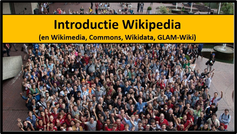

* **Korte omschrijving:** Wil je weten hoe Wikipedia werkt: zowel voor als achter de schermen? Ben je nieuwsgierig naar de kansen die Wikipedia biedt voor bibliotheken en erfgoedinstellingen als de KB? Misschien heb je wel eens gehoord over Wikimedia Commons of Wikidata en vraag je je af wat dat met Wikipedia te maken heeft. En hoe zit het met de gemeenschap achter Wikipedia? Met dit soort vragen is het een goed idee om deze cursus te volgen.
* **Vorm:**  Interactieve presentatie van pm. 75 minuten
* **Geschikt voor:** Mensen die Wikipedia vooral kennen als naslagwerk om dingen op te zoeken en nieuwsgierig zijn naar hoe Wikipedia achter de schermen werkt.
* **Links:** [Beschrijving van deze cursus](https://zenodo.org/record/7664552) (Zenodo)

### Wikipedia voor openbare bibliotheken (inspiratiesessie)
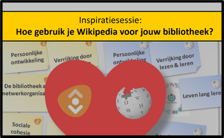

* **Korte omschrijving:** Deze presentatie belicht de parallellen tussen de publieksdoelstellingen van openbare bibliotheken, 21e eeuwse vaardigheden en Wikipedia [o.b.v. dit document](https://nl.wikipedia.org/wiki/Wikipedia:GLAM/Wikipedia_in_de_Openbare_Bibliotheek/WaaromSamenwerken).  *Voor veel mensen, ook in de bibliotheeksector, is Wikipedia vooral handig om snel feiten op te zoeken. Minder bekend is dat er achter deze site een netwerk van schrijvers, fotografen, programmeurs, data-analisten en andere makers actief is. Zij besteden veel tijd aan het verbeteren van de encyclopedie. Niet omdat het moet, maar omdat het leuk en leerzaam is. De vaardigheden die ze hiermee informeel ontwikkelen – o.a. onderzoeken, samenwerken, organiseren, programmeren of omgaan met kritiek - vertonen opvallende parallellen met de 21e-eeuwse vaardigheden.* 
* **Vorm:**  Presentatie van pm. 30 minuten
* **Geschikt voor:** Medewerkers van openbare bibliotheken
* **Links:** [Beschrijving van deze sessie](https://zenodo.org/record/7708702) (Zenodo)

## Wikimedia Commons 

### Workshop: Afbeeldingen uploaden naar Wikimedia Commons (basiscursus)
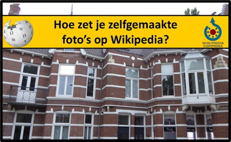

* **Korte omschrijving:** Uitleg over het uploaden van zelfgemaakte foto's naar Wikimedia Commons en het gebruik van deze foto's in artikelen op Wikipedia.
* **Vorm:** Interactieve workshop van 2-3 uur
* **Geschikt voor:** Fotografen die graag willen leren hoe ze hun zelfgemaakte foto’s nuttig kunnen inzetten als beeldmateriaal voor Wikipedia. 
* **Links:** [Impressie van deze workshop](https://commons.wikimedia.org/wiki/File:Uitleg_foto's_uploaden_Wikimedia_Commons,_Openbare_Bibliotheek_'s-Hertogenbosch.pdf) (PDF, Wikimedia Commons)

### Workshop: Ik zie ik zie wat jij niet ziet
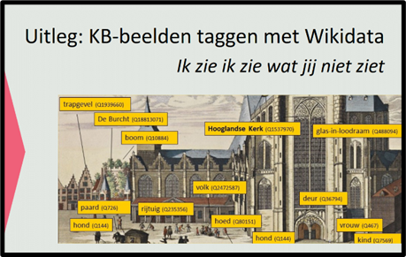

* **Korte omschrijving:** In deze workshop leer je stap voor stap hoe je erfgoedafbeeldingen die op Wikimedia Commons staan beter vindbaar, zichtbaar en herbruikbaar maakt door aan te geven (te taggen) welke dingen (entiteiten) er te zien zijn op die afbeeldingen. Dit gebeurt door die dingen te verbinden met Wikidata-items.
* **Vorm:**  Workshop - na een korte uitleg kunnen deelnemers onder begeleiding aan de slag met het taggen, en kunnen daar na de workshop zelfstandig mee verder.
* **Geschikt voor:** Erfgoedliefhebbers met enige praktijkervaring met Wikimedia Commons en Wikidata. Je maakt op een laagdrempelige manier verder kennis met deze platformen.
* **Links:** [Beschrijving van deze workshop](https://zenodo.org/record/7777755) (Zenodo)

## Wikidata

### Wegwijzer in Wikidata (basiscursus)
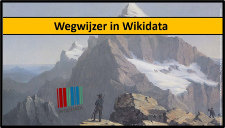

* **Korte omschrijving:** In deze cursus wordt je op basisniveau wegwijs (en enigszins zelfredzaam) gemaakt in de wereld van [Wikidata](https://www.wikidata.org/). Hierbij zullen zowel de technische als de community-aspecten de revue passeren.
* **Vorm:** Presentatie van pm. 90 minuten (met eventueel een korte pauze)
* **Geschikt voor:** Mensen die al wel eens van Wikidata gehoord hebben, maar nog niet weten wat het precies is, en/of vooral op zoek zijn naar een overkoepelend overzicht van de Wikidata-wereld.
* **Links:** [Beschrijving van deze cursus](https://zenodo.org/record/8006441) (Zenodo) + [Overzicht van de onderwerpen die behandeld worden](https://github.com/KBNLwikimedia/Wikidata-General-Overview) (Github)

### Wikidata & de KB (verdieping)
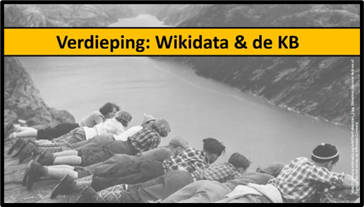

* **Korte omschrijving:** Wil je weten waarom en hoe de KB Wikidata inzet om haar erfgoedcollecties beter zichtbaar, vindbaar en herbruikbaar te maken? Of wil je meer weten over de relatie tussen Wikidata en de KB-thesauri in data.bibliotheken.nl? Met dit soort vragen is het een goed idee om de verdiepende cursus "Wikidata & de KB" aan te vragen.
* **Vorm:** Presentatie van pm. 75 minuten
* **Geschikt voor:** Mensen die nieuwsgierig zijn naar hoe en waarom de KB gebruik maakt van, en bijdraagt aan Wikidata. Voor deze sessie is noodzakelijk om basiskennis over Wikidata te hebben (bv. door de basiscursus Wegwijzer in Wikidata te volgen). 
* **Links:** [Beschrijving van deze cursus](https://zenodo.org/records/10160817) (Zenodo) + [Overzicht van de onderwerpen die behandeld worden](https://github.com/KBNLwikimedia/Wikidata-KB-Overview) (Github) 

### Binnenkort: Workshop SPARQL & Wikidata voor beginners
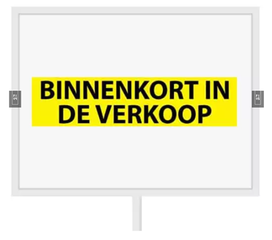

Deze workshop wordt momenteel nog niet aangeboden.
* **Korte omschrijving:** In deze workshop leer je stap voor stap hoe je m.b.v. de [SPARQL-zoektaal](https://www.wikidata.org/wiki/Wikidata:SPARQL_tutorial) eenvoudige vragen kunt stellen aan Wikidata, en de zoekresultaten verder kunt verwerken. 
* **Vorm:** Interactieve workshop van 1-1.5 uur
* **Geschikt voor:** Mensen die willen leren hoe je gegevens uit Wikidata kunt opvragen en visualiseren, maar nog geen (succes)ervaring met SPARQL hebben. Kennis over de structuur van Wikidata o.b.v Items (Qs) en Properties (Ps) is hierbij onmisbaar (dit komt aan bod in de basiscursus Wegwijzer in Wikidata).
* **Links:** Een beschrijving van deze cursus wordt z.s.m. toegevoegd.

### Workshop: Kaarten maken met Wikidata (geavanceerd)
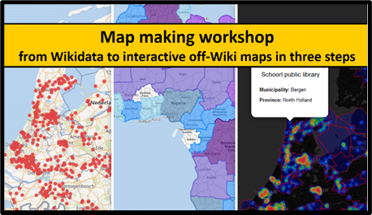

* **Korte omschrijving:** Je leert hoe je zowel platte, geclusterde, gelaagde, ingebedde, interactieve, on-Wiki en off-Wiki-kaarten kunt maken uit datasets van geo-gerefereerde items in Wikidata.
* **Vorm:** Interactieve workshop van 90-120 minuten
* **Geschikt voor:** Hoewel deze workshop technisch van aard is en basistechnieken en programmeertools van Wikidata, Wikipedia en Wikimedia Commons zal behandelen, is deze workshop wel toegankelijk voor beginnende Wikidata-bijdragers en programmeurs. De workshopleider, zelf geenszins een gevorderde Python-programmeur of Wikidata-SPARQL-goeroe, geeft voorbeelden en codesnippets die je eenvoudig zelf kunt aanpassen met enige basiskennis over SPARQL, Wikidata en Python.
* **Links:** [Volledige beschrijving van deze workshop](https://github.com/KBNLwikimedia/WikidataMapMakingWorkshop) (Github)

## Wikibase

### Basiscursus Wikibase
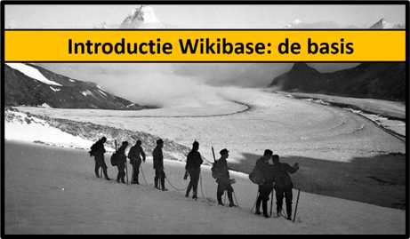

* **Korte omschrijving:** Als je wel eens iets met Wikidata gedaan hebt, is er grote kans dat je de term "Wikibase" wel eens bent tegengekomen. Maar wat is Wikibase precies? En wat is de relatie tussen Wikidata en Wikibase? Welke (on)mogelijkheden biedt deze software voor de KB en andere instellingen in binnen- en buitenland? En hoe zit het met de community rondom Wikibase? 
Deze cursus is een vervolg op introductiesessie Wegwijzer in Wikidata.
* **Vorm:** Presentatie van pm. 90 minuten (met eventuele korte pauze)
* **Geschikt voor:** Mensen met enige kennis van Wikidata en die meer willen weten over Wikibase en nieuwsgierig zijn naar de verschillen en overeenkomsten tussen Wikidata en Wikibase.
* **Links:** [Beschrijving van deze cursus](https://zenodo.org/record/8338811) (Zenodo) + [Overzicht van de onderwerpen die behandeld worden](https://github.com/KBNLwikimedia/Wikibase-resources) (Github)

## OpenRefine

### Workshop: Introductie OpenRefine & Wikidata
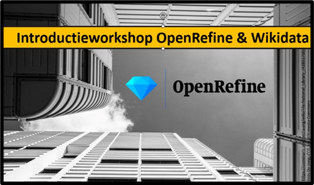

* **Korte omschrijving:** [OpenRefine](https://openrefine.org/) is een bekende tool voor het bewerken, verrijken en manipuleren van data. Het wordt veel gebruikt binnen de Wikimedia-gemeenschap om gegevens aan Wikidata toe te voegen.  
In deze workshop leer je de basisprincipes van het werken met OpenRefine om data te bewerken en toe te voegen aan Wikidata. Je leert hoe je een OpenRefine-project aanmaakt, hoe je data kunt manipuleren en verrijken, en hoe je deze gegevens koppelt met databases zoals Wikidata, NTA of VIAF.
* **Vorm:** Praktische workshop van 90 minuten.
* **Geschikt voor:** Mensen die enige ervaring hebben met het werken met (cultureel erfgoed)data en OpenRefine nog niet eerder hebben gebruikt, maar wel de basis van het manipuleren, verrijken en koppelen van data met deze tool willen leren, en nog niet weten wat ‘datareconciliatie’ inhoudt.
* **Links:** [Volledige beschrijving van deze workshop](https://github.com/KBNLwikimedia/OpenRefine-Introduction-Workshop) (Github)

### Workshop: OpenRefine & Wikimedia Commons
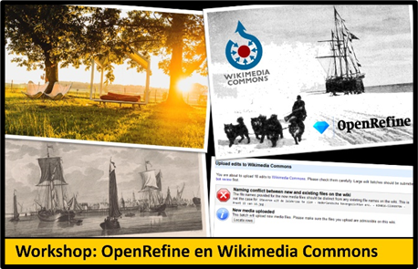

* **Korte omschrijving:** In deze workshop leer je hoe je OpenRefine gebruikt om nieuwe afbeeldingen met reguliere bestandsbeschrijvingen (Wikitext) en gestructureerde gegevens aan Wikimedia Commons toe te voegen. Ook leer je hoe je gestructureerde gegevens aan bestaande Commons-bestanden kunt toevoegen met behulp van OpenRefine.
* **Vorm:** Interactieve workshop van 60-90 minuten
* **Geschikt voor:** Mensen die bekend zijn met OpenRefine, hiermee vlot en zelfstandig gegevens aan Wikidata hebben toegevoegd en die weten wat "reconciliëren" inhoudt, maar nog niet weten hoe ze OpenRefine moeten gebruiken om afbeeldingen en gestructureerde gegevens toe te voegen aan Wikimedia Commons.
Deze workshop is niet geschikt voor mensen die nog nooit met OpenRefine, Wikidata en/of Wikimedia Commons hebben gewerkt.
* **Links:** [Volledige beschrijving van deze workshop](https://github.com/KBNLwikimedia/OpenRefine-WikimediaCommons-Workshop) (Github)
